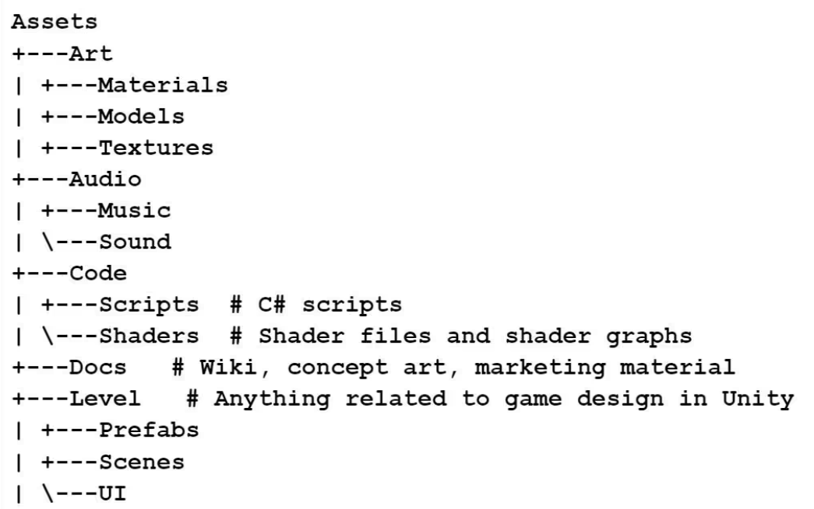

# 🏝️Stephanie's Animal Rescue - Secret Island - Game development

**Project Overview**  
Secret Island is an interactive educational game prototype designed to engage users in learning about wildlife and conservation through immersive gameplay. The storyline follows a team of animal rescuers who receive alerts about injured animals and undertake rescue missions in real-life locations, starting with Australia’s Northern Territory. The game combines fun gameplay mechanics with factual information, encouraging players to explore, learn, and take action in rescuing endangered species.

**🎮 Game Features**

- **Animal Rescue Missions**: Players receive rescue alerts from Flash and coordinate with Ketch to save injured animals.
- **Interactive Search & Find**: Use the HUD to locate hidden animals based on their silhouettes and characteristics.
- **Educational Content**: Factual information about animals from the Malak region provided by Deakin University’s fact sheets.
- **Audio & Visual Rewards**: Players are rewarded with sound effects, created by Magic Studios, for correctly identifying animals.
- **Immersive Learning**: Players can explore real-life environments, enhancing their knowledge of wildlife and conservation.

**🛠️ Tech Stack**

- **2D/3D modelling** – Blender/photoshop
- **Game Engine/App development**: Unity
- **Sound Design**: Audio effects provided by Magic Studios ,Will.
- **Version Control/storage**: GitHub

**🔊 Sound Effects**

- Thanks to the generous support of **Magic Studios**, sound effects are included to enhance player immersion. When players click on an animal in the search task, they will hear the corresponding animal sound, and the HUD will light up to confirm the find.

**🎓 Student Onboarding Task**

To get everyone up to speed and ready to contribute to the project, please follow these steps:

**1. Download Unity Hub**

- Go to the Unity Hub download page and install Unity Hub on your system.

**2. Install Unity Version 6000.0.41f1**

- Open Unity Hub and go to the **Installs** tab.
- Click on **Add**, then select version **6000.0.41f1** (LTS).
- Ensure you include the **Windows Build Support** and **Mac Build Support** modules (depending on your operating system).

**3. Upskilling Task**

As a simple learning exercise, especially for those new to Unity:

- **Create a 2D Project**:
  - Open Unity Hub, click on **New Project**, and select **2D (Core)** as the project template.
  - Name your project "SecretIsland_Upskill" and choose a location to save it.
- **Set up a Scene**:
  - Add a few objects (like squares, circles, or sprites) to your scene.
  - Create a **C# script** and attach it to one of the objects. The script should make the object perform a simple action (e.g., move, rotate, or change color).

## 📂 Project File Structure

Below is the project file structure used to organize assets and code for the game. This structure promotes a clean, maintainable, and scalable project workflow.

**Assets**  
- **Art**  
  - **Materials**: Materials for 3D/2D rendering.  
  - **Models**: 3D models created or imported.  
  - **Textures**: Textures for models.  
- **Audio**  
  - **Music**: Background music tracks.  
  - **Sound**: Sound effects for gameplay.  
- **Code**  
  - **Scripts**: C# scripts driving the game.  
  - **Shaders**: Custom shaders and visual effects.  
- **Docs**: Documentation, concept art, and marketing material.  
- **Level**  
  - **Prefabs**: Reusable game objects and components.  
  - **Scenes**: Game levels and environments.  
  - **UI**: User interface assets.  

### Why This Structure?

1. **Modularity**: Each type of asset is grouped logically to avoid clutter.  
2. **Scalability**: Makes it easy to add new content without affecting existing files.  
3. **Collaboration**: Facilitates teamwork by ensuring assets are easy to locate and manage.  

---

## 🎓 Student Onboarding Task

To get everyone up to speed and ready to contribute to the project, please follow these steps:

### 1. Download Unity Hub

- Go to the Unity Hub download page and install Unity Hub on your system.

### 2. Install Unity Version 6000.0.41f1

- Open Unity Hub and go to the **Installs** tab.
- Click on **Add**, then select version **6000.0.41f1** (LTS).
- Ensure you include the **Windows Build Support** and **Mac Build Support** modules (depending on your operating system).

### 3. Upskilling Task

As a simple learning exercise, especially for those new to Unity:

- **Create a 2D Project**:
  - Open Unity Hub, click on **New Project**, and select **2D (Core)** as the project template.
  - Name your project "SecretIsland_Upskill" and choose a location to save it.
- **Set up a Scene**:
  - Add a few objects (like squares, circles, or sprites) to your scene.
  - Create a **C# script** and attach it to one of the objects. The script should make the object perform a simple action (e.g., move, rotate, or change color).

